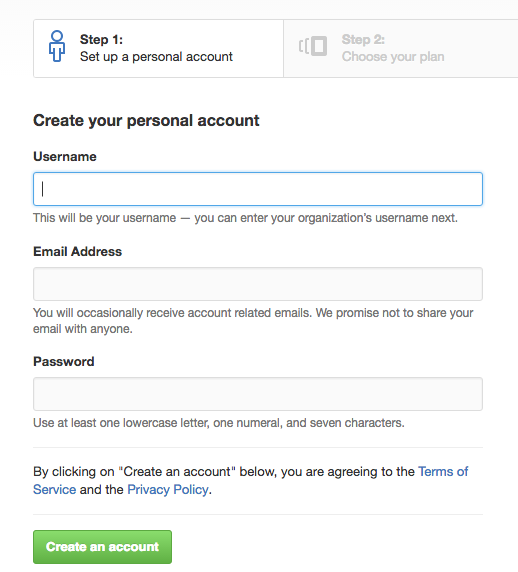

# Creating a Github account

1. Navigate to [https://github.com/join](https://github.com/join)
  - 
1. Pick a username that is professional.
  - e.g. Mine is `jcscottiii`
  - How people will `@` you.
1. E-mail address and password is a given.
