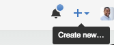
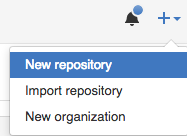
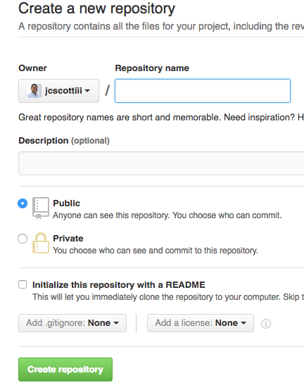

# Your First Repository

## Creating a repository

1. Go to the [Github homepage](https://github.com) and find the `+` button at the top right.
  - 
1. Click the `+` sign.
  - 
1. You should see the following form:
  - 

## Creating files

### README.md
If you place a file called `README.md` in any folder, it will display that for you automatically when you click on that folder.

## Creating folders

## Exercise - Creating a free website hosted by Github.

### Purpose

Create a website

### Create a repository as stated above.
- Name the repository: `<your-username>.github.io`.
  - e.g. For the username `jcscottiii`, the repository should be `jcscottiii.github.io`.
  - It is important the name has your username.

### Launch the web generator
