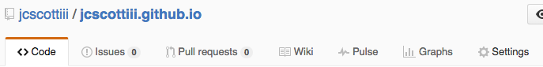
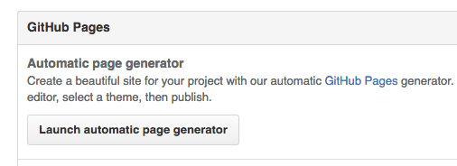

# Your First Repository

## Exercise

Icebreaker: Two Truths and A Lie Repository.

Go to the [Github homepage](https://github.com) and find the `+` button at the top right.

Click the `+` sign.

You should see the following form:

## Creating your first file.

Click the `Create File Button`

## Name the file: `README.md`

Note: If you place a file called `README.md` in any folder, it will display that for you automatically when you click on that folder.

## How to use the form

|Edit|Preview|
|---|---|
|||

## Two Truths and A Lie:

Write down two truths and a lie.

Use the Markdown Quick Start

Format it however you want.

>**DO NOT PRESS THE CREATE FILE BUTTON YET**

## Committing the File

## Creating folders

## Editing a file

You don't need any special programs to edit a file once you create / upload one.

Note: great for non-programmers.

Find the file you want and click on it.

Click the `pen` button to edit the file.

Make the changes. If it's a markdown file, you can click the preview button before making the commit.

## Exercise - Creating a free website hosted by Github.

### Purpose

Create a website

### Create a repository as stated above.
- Name the repository: `<your-username>.github.io`.
  - e.g. For the username `jcscottiii`, the repository should be `jcscottiii.github.io`.
  - It is important the name has your username.

### Activate Prose.io
- Go to [prose.io](http://prose.io/)

### Launch the web generator
Go to the settings button in your repository.

Scroll down to the Github Pages generator

Change the Page Name to `About Me`.
